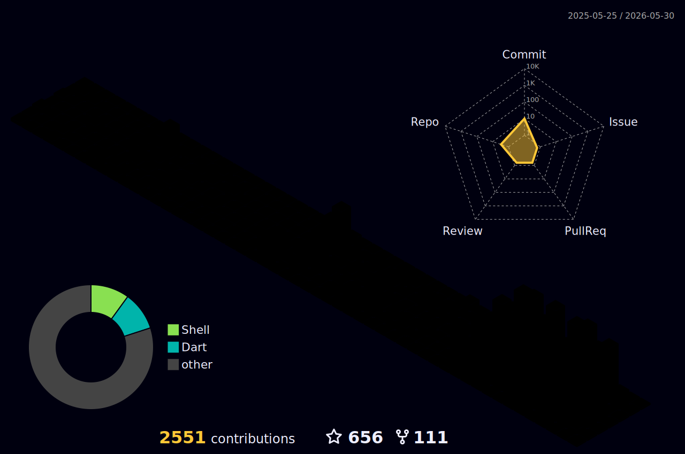

<div align="center">

<!-- ANIMATED HEADER -->


<!-- TYPING ANIMATION -->
<a href="https://github.com/Anonym0usWork1221">
  
</a>

<br/>


&nbsp;

&nbsp;


</div>

---

<table width="100%">
<tr>
<td width="55%" valign="top">

## `> whoami`

```bash
┌──(moez㉿darkbytes)-[~]
└─$ cat about.txt
```

```yaml
Name        : Abdul Moez
Alias       : Anonym0usWork1221
Role        : Ethical Hacker · Rev Engineer · Dev
Education   : BSCS — GCU Lahore, Pakistan
Organization: DarkBytes (thedarkbytes.com)
Telegram    : @RULEROFCODES
Status      : Always learning. Always hacking.

Interests:
  - Ethical Hacking & Penetration Testing
  - Reverse Engineering & Binary Analysis
  - Full-Stack Web & Mobile Development
  - Machine Learning & AI Systems
  - Open-Source Tooling & Automation

Mantra: "To write in code is to craft the
         language of the mind; where thoughts
         take shape and logic doth bind."
```

</td>
<td width="45%" valign="top">

## `> stats --live`


</td>
</tr>
</table>

---

<div align="center">

## `> achievements --stats`


&nbsp;

&nbsp;

&nbsp;


<br/>


&nbsp;

&nbsp;

&nbsp;


</div>

---

<div align="center">

## `> languages --top`


&nbsp;&nbsp;


</div>

---

## `> tech-stack --all`

### ◈ Languages

<div align="center">

</div>

### ◈ Frameworks & Libraries

<div align="center">

</div>

### ◈ Databases & Caching

<div align="center">

</div>

### ◈ Cloud & DevOps

<div align="center">

</div>

### ◈ Tools & Platforms

<div align="center">

</div>

### ◈ Security Arsenal

<div align="center">


</div>

---

<div align="center">

## `> git log --graph --all`


</div>

---

<div align="center">

## `> snake --eat-contributions`

<picture>
  <source media="(prefers-color-scheme: dark)" srcset="./snake-dark.svg" />
  <source media="(prefers-color-scheme: light)" srcset="./snake.svg" />
  
</picture>

</div>

---

<div align="center">

## `> contrib --3d`



</div>

---

## `> ls ~/projects --featured`

<div align="center">

<a href="https://github.com/Anonym0usWork1221/Free-Proxies">
  
</a>
<a href="https://github.com/Anonym0usWork1221/C-Android-Memory-Tool">
  
</a>
<a href="https://github.com/Anonym0usWork1221/android-memorytool">
  
</a>
<a href="https://github.com/Anonym0usWork1221/GMapsScraper">
  
</a>

</div>

---

## `> contact --social`

<div align="center">

<a href="https://github.com/Anonym0usWork1221">
  
</a>
&nbsp;
<a href="https://www.linkedin.com/in/abdulmoez12">
  
</a>
&nbsp;
<a href="https://thedarkbytes.com">
  
</a>

<br/><br/>

<a href="https://t.me/RULEROFCODES">
  
</a>
&nbsp;
<a href="https://t.me/RulerKingCodes">
  
</a>
&nbsp;
<a href="https://www.youtube.com/@rulerking_">
  
</a>

</div>

---

<div align="center">


<br/><br/>


*If my repos helped you — drop a star. It keeps me going.*

</div>
